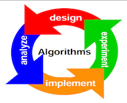
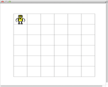
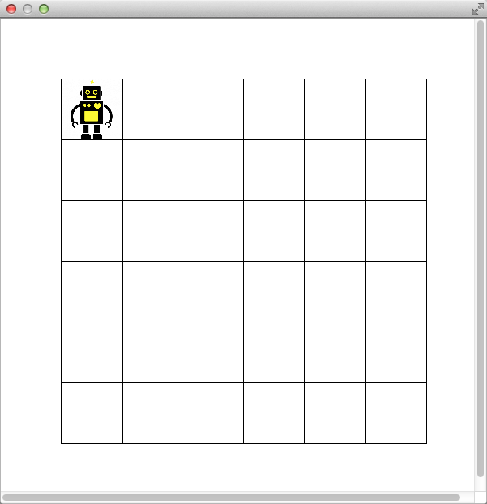

#Repetition Structures - Counting Squares





One of the advantages of using computer programs is that we can easily implement repetitive tasks. Structures such as `for`, `while`, and `do-while` allow us to repeat a block of instructions as many times as needed. These structures are also referred to as *repetition structures*. 

Algorithms are one of the fundamental concepts in Computer Science. Given a small set of instructions and the basic programming structures, we can solve many problems. In this laboratory experience, you will practice the creation of algorithms simulating a robot that must explore a space using a set of very limited instructions.

##Objectives:

1. Design algorithms using sequential, decision and repetition structures.
2. Analyze the number of steps of the proposed algorithms and try to minimize them.
3. Practice invoking the methods of an object.

This laboratory experience is an adaptation of http://nifty.stanford.edu/2015/tychonievich-sherriff-layer-counting-squares/ .


##Pre-Lab:

Before arriving to the laboratory you should have:

1. Reviewed the basic decision and repetition structures for C++.
2. Reviewed the creation of objects and how to invoke their methods.
3. Studied the concepts and instructions for the laboratory session.
4. Taken the Pre-Lab quiz, available in Moodle.


---

---


## Counting Squares

In this laboratory experience, we will be programming a robot that has been placed in a grid of square rooms. Each one of the four walls in each room can have a door. Only the walls of adjoining rooms have doors. The walls that make up the grid's exterior do not have doors.

---



**Figure 1.** The robot is in the room on the upper left of the 36 room grid.

---

The only commands the robot understands are:

1. Verify if there is a door on the wall to the north (N), south (S), east (E), or west (W) of the room where it currently is.
2. Move to the room that is located towards the north (N), south (S), east (E), or west (W) of the current room.
3. Create variables and assign them values.
4. Carry out basic operations for sum, subtraction, multiplication and division.
5. Use decision and repetition structures.
6. Display the results on the screen.


## Objects and Methods

The following is the `main` function of a basic program like the one you will be creating. During the laboratory experience you only need to program the `main` function (within the `main.cpp` file). The rest of the files contain functions that implement the functionality of the instructions the robot understands.

---

```cpp
int main(int argc, char *argv[]) {
    QApplication   a(argc, argv);

    // Create the grid and the robot
    MainGameWindow *w = new MainGameWindow(Mode::RECT_RANDOM);
    w->show();

    // Show the word "Start"
    w->display("Start");

    // Move the robot towards the west while possible,
    // counting the number of steps the robot moves

    int ctr = 0;
    while (w->canMove('W')) {
        w->moveRobot('W');
        ctr = ctr + 1;
    }

    // Display the total steps taken by the robot
    w->display("Total: " + QString::number(ctr));

    return a.exec();
}

```

**Figure 2** Example of the `main` Function.

---

In the example we are creating a robot within the grid that only knows how to check if there is a door towards the west and (if there is one), walk towards that direction. Let us see the function, line by line.

The first line creates the only object you should create, an object of the `MainGameWindow` class. The parameter `Mode::SQUARE_TOP_LEFT` specifies that the grid will be square and that the robot will start in the upper left corner. Other options for the parameter are `RECT_TOP_LEFT`, `RECT_RANDOM` and `PYRAMID_RANDOM`.

`MainGameWindow *w = new MainGameWindow(Mode::SQUARE_TOP_LEFT);`

The following shows the object `w`.

`w->show();`

The `void display(QString)` method displays short messages on the screen. For example:

`w->display("Start");`

shows the word "Start" before the robot starts to move. The code that follows:

```cpp
int ctr = 0;
while ( w->canMove('W') ) {
    w->moveRobot('W');
    ctr = ctr + 1;
}
```

illustrates the use of the `bool canMove(char)` and `void moveRobot(char)` methods:

* `bool canMove(char)` - accepts as a parameter one of the following letters: `'N'`, `'S'`, `'E'` or `'W'` and returns `true` if a door exists in that direction from the room where the robot is currently found.
* `void moveRobot(char)` - accepts as a parameter one of the letters `'N'`, `'S'`, `'E'` or `'W'` and moves the robot to the next room that is found in that direction.

In the example, the code is trying to move the robot as many times as it can towards the west (`W`), and counting the number of rooms in that direction.

---

---


!INCLUDE "../../eip-diagnostic/repetitions-countingsquares/en/diag02.html" 
<br>

!INCLUDE "../../eip-diagnostic/repetitions-countingsquares/en/diag01.html" 
<br>


---

---


## Laboratory Session:

### Exercise 1 - Square Grid

Suppose that the robot is currently in the upper left room (northwest) of a **square** space of rooms, i.e. the space contains the same number of rows and columns of rooms (like the one in Figure 1). Design an algorithm that allows the robot to compute the number of rooms that there are in the grid.

#### Instructions

1. Load the project  `CountingSquares` into `QtCreator`. There are two ways to do this:

    * Using the virtual machine: Double click the file `CountingSquares.pro` located in the folder `/home/eip/labs/repetitions-countingsquares` of your virtual machine.
    * Downloading the project’s folder from `Bitbucket`: Use a terminal and write the command `git clone http:/bitbucket.org/eip-uprrp/repetitions-countingsquares` to download the folder `repetitions-countingsquares` from `Bitbucket`. Double click the file `CountingSquares.pro` located in the folder that you downloaded to your computer.

2. Configure the project. The project consists of various files. **You will only write code in the file** `main.cpp`. The rest of the files contain functions that implement the functionality of the instructions the robot can understand.

3. When writing your algorithm, you should make sure that the `MainGameWindow` object is created using the argument `Mode::SQUARE_TOP_LEFT`. Remember, the robot does not know beforehand how many rooms there are. Test your algorithm with some examples.

4. If the size of the grid is 3x3, how many rooms should the robot visit to complete your algorithm? How about 4x4? How about $$n \times n$$ rooms?

5. Suppose we want to minimize the amount of energy used by the robot. Can you create an algorithm that uses less steps for the same grid size?

6. Once you have finished your algorithm, and made it correct and efficient, hand it in using Deliverable 1 in Moodle. On the algorithm's header, write and explain the expression you found about the number of rooms the robot should visit to complete its task for a grid of size $$n \times n$$ (For example, "The robot takes 2x+5 steps, 5 to arrive at the middle and 2n to count the rest").


### Exercise 2 -  Rectangular Grid

#### Instructions

1. Suppose that now the robot is in the upper left room (northwest) of a **rectangular** space (not necessarily square) of rooms. Design an algorithm so the robot can compute the number of rooms in the grid.

2. To test this part of the program you should make sure the `MainGameWindow` object is created using the argument `Mode::RECT_TOP_LEFT`.

3. Once you have finished your algorithm, and made it correct and efficient, implement it in the `main` function. In the header of the program, write and explain the expression you found about the number of rooms the robot should visit to complete its task for a grid of size  $$m \times n$$. 

4. Hand in the `main.cpp` file with the code to calculate the number of rooms in a rectangular grid using Deliverable 2 in Moodle.

### Exercise 3 - Rectangular Grid, Random Position

#### Instructions

1. Suppose that now the robot starts its task in any of the rooms in a **rectangular** grid (not necessarily square). Design an algorithm so the robot can compute the number of rooms there are in the grid.

2. To test this part of the program you should make sure the `MainGameWindow` object is created using the argument `Mode::RECT_RANDOM`.

3. Once you have finished your algorithm, and made it correctly and efficiently, implement it in the `main` function. In the header of the program, write and explain the expression you found about the number of rooms the robot should visit to complete its task for a grid of size  $$m \times n$$. In this case, the number of rooms to visit will depend on the robot's initial position, so express the worst case, i.e. according to your algorithm, how many rooms should the robot visit if it starts in the *worst* room.

4. Hand in the `main.cpp` file with the code to calculate the number of rooms in a rectangular grid with the robot in a random position using Deliverable 3 in Moodle.


### Exercise 4 - Pyramid Grid, Random Position

#### Instructions

1. Suppose that now the robot starts its task in any of the rooms in a grid shaped like a pyramid. Design an algorithm so the robot can compute the number of rooms there are in the grid.

2. To test this part of the program you should make sure the `MainGameWindow` object is created using the argument `Mode::PYRAMID_RANDOM`.

3. Once you have finished your algorithm, and made it correct and efficient, implement it in the `main` function. In the header of the program, write and explain the expression you found about the number of rooms the robot should visit to complete its task for a grid of size  $$m \times n$$. In this case, the number of rooms to visit will depend on the robot's initial position, so express the worst case, i.e. according to your algorithm, how many rooms should the robot visit if it starts in the *worst* room.

4. Hand in the `main.cpp` file with the code to calculate the number of rooms in the pyramid with the robot in a random position using Deliverable 4 in Moodle.


---

---

## Deliverables

Use the "Deliverable" links in Moodle to hand in the algorithm for Exercise 1 and the `main.cpp` files that contain the code you implemented in exercises 2, 3 and 4. Remember to use good programming techniques, to include the names of the programmers involved, and to document your program.


---

---

## References

[1] Luther A. Tychonievich, Mark S. Sherriff, and Ryan M. Layer, http://nifty.stanford.edu/2015/tychonievich-sherriff-layer-counting-squares/


