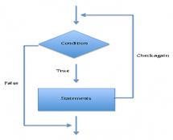
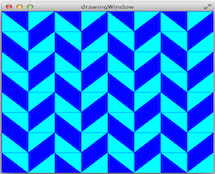
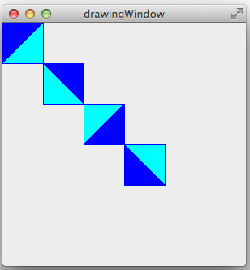
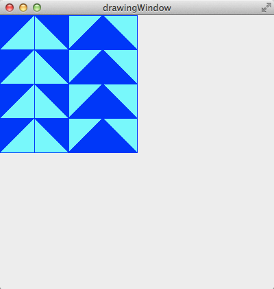
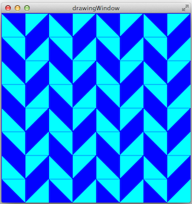
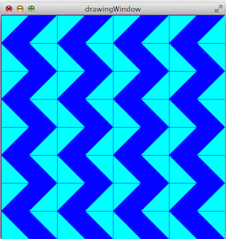

# Repetition Structures - Tessellations






One of the advantages of using computer programs is that we can easily implement repetitive tasks. Structures such as the `for`, `while`, and `do-while` allow us to repeat a block of instructions as many times as needed. In this laboratory experience, you will use `for` loops to produce patterns and mosaics. This laboratory experience is an adaptation of https://sites.google.com/a/wellesley.edu/wellesley-cs118-spring13/lectures-labs/lab-2.


## Objectives:

1. Practice the use of repetition structures to make patterns and tessellations.

2. Strengthen the use of functions and objects.


## Pre-Lab:

Before coming to the laboratory session you should have:

1. Reviewed the basic concepts related to repetition structures.

2. Studied the concepts and instructions for the laboratory session, especially the use of the methods for:

    a. adjusting the size of the windows,

    b. adjusting the position of the tessellations,

    c. rotating the tessellations.

3. Taken the Pre-Lab quiz, available in Moodle.

---

---

## Tessellations

A tessellation is a mosaic that is created by repeating a figure to cover the surface without leaving empty spaces or overlapping the figures. A *regular tessellation* is a figure that is made by repeating the same *regular polygon*, like triangles, squares or hexagons. (A regular polygon is a polygon where all sides are congruent and the angles that form the sides are congruent.)

---


**Figure 1.** The only regular tessellations possible obtained using triangles, squares and hexagons.

---


## Library

The `Tessellations.pro` project available in `http://bitbucket.org/eip-uprrp/repetitions1-tessellations` contains the `Tessellation` class, which is an abstraction of a tessellation with squares, and the `DrawingWindow` class. The code shown in Figure 2 creates a `DrawingWindow` called `w`, a `Tesselation` called `t` and places the tessellation in position (50,100). Notice that the `addTessellation` method of the `DrawingWindow` class should be invoked to draw the tessellation.

---

```cpp
int main(int argc, char *argv[]) {
    QApplication a(argc, argv);

    DrawingWindow w;        // Creates the w object of the DrawingWindow class    
    w.resize(300, 300);
    w.show();

    Tessellation t;          // Creates the t object of the Tessellation class 
    t.move(50,100);         // Sets the tessellation's position

    w.addTessellation(t);    // Adds the tessellation to the window

    return a.exec();
}
```

**Figure 2.** Code in the `main` function to create a window and tessellation.

---

The window that is obtained with the code in Figure 2 is similar to the window in Figure 3. The arrows and the numbers 50 and 100 illustrate the spaces between the tessellation's upper left corner and the window's borders. The tessellation's upper left corner is in the position (50,100).

---


**Figure 3.** Window with the tessellation in the position (50,100).

---

**Example 1.** The code in Figure 4 contains a `foo` function to draw four tessellations in the positions (0,0), (50,50), (100,100), and (150,150), with the original figure's rotation of $$0^\circ, 90^\circ, 180^\circ y 270^\circ$$ (clockwise).

---

```cpp
int foo(DrawingWindow &w) {
    int rot = 0;
    for (int i = 0; i < 4; i++) {
        Tessellation t;
        t.setRotation(rot);
        t.move(i * 50, i * 50);
        w.addTessellation(t);
        rot += 90;
    }
}

int main(int argc, char *argv[]) {
    QApplication a(argc, argv);

    DrawingWindow w;
    w.resize(300, 300);
    w.show();

    foo(w);
    return a.exec();
}
```

**Figure 4.** Code for the `foo` function that draws four tessellations.

---

Observe how the `foo` function needs to receive a reference to the `w` object of the `DrawingWindow` class since its invoking the `addTessellation` method of the class in each iteration of the loop. The figure that is obtained is similar to the one in Figure 5.

---



**Figure 5.** Tessellations drawn by the `foo` function in the code in Figure 4.

---

**Example 2.** The code in Figure 6 shows an example of how to use nested loops to create tessellations.

---

```cpp
int fah(DrawingWindow &w) {
    int rot = 0;
    for (int i = 0; i < 4; i++) {
      for (int j = 0; j < 4; j++) {
        Tessellation t;
        t.move(i * 50, j * 50);
        t.setRotation(rot);
        w.addTessellation(t);
      }
      rot += 90;
    }
}
```

**Figure 6.** Code for the `fah` function that uses nested loops to draw four tessellations.

The figure that is obtained is similar to the one in Figure 7.

---



**Figure 7.** Tessellations drawn by the `fah` function in the code in Figure 6.

---

---

!INCLUDE "../../eip-diagnostic/tesselations/en/diag-tesselations-01.html"
<br>

!INCLUDE "../../eip-diagnostic/tesselations/en/diag-tesselations-02.html"
<br>

---

---


## Laboratory Session:

In today's laboratory experience you will practice the use of nested loops to create different tessellations.

### Exercise 1 - Study the Loop that Produces Tessellations

#### Instructions

1. Load the project `Tessellations` into `QtCreator`. There are two ways to do this:

     * Using the virtual machine: Double click the file `Tessellations.pro` located in the folder `/home/eip/labs/repetitions-tessellations` of your virtual machine.
     * Downloading the project’s folder from `Bitbucket`: Use a terminal and write the command `git clone http:/bitbucket.org/eip-uprrp/repetitions-tessellations` to download the folder `repetitions-tessellations` from `Bitbucket`. Double click the file `Tessellations.pro` located in the folder that you downloaded to your computer.

2. The `Tessellations.pro` project contains the `Tessellations` and `DrawingWindow` classes and the `foo` function. Configure the project and run the program by clicking the green arrow in the menu on the left side of the Qt Creator window. You should see a window similar to the one in Figure 5.

     This figure is created with the `foo` function shown in Figure 4 and explained in Example 1. The `foo` function is invoked from `main()`. In this laboratory experience you will only be making changes to the `main()` function.

     Study the `foo` function once again and notice the creation of the objects from the `Tessellations` class, the use of the `setRotation` method, and the `move` method to set the tessellation in the desired position. Notice how the instructions in the `for` loop in the function use the loop's counter to determine the square's position and how the rotation's value is incremented. Also notice that you will need to use the `addTessellation` method to add the tessellation to the `w` window.


### Exercise 2 - Create the `herringbone` Function and Tessellation

#### Instructions

1. Create a `herringbone` function that produces the tessellation in Figure 8. The size of the window is 400x400. The size of each square in the tessellation is its size by default: 50x50.

    ---

    

    **Figure 8.** Tessellation that the `herringbone` function should draw.

    ---

2. Comment the invocation of the `foo` function.

3. Invoke the `herringbone` function from `main()` and run the program so you can see the tessellation you created.

### Exercise 3 - Create the `zigzag` Function and Tessellation

#### Instructions

1. Create a `zigzag` function that produces the tessellation in Figure 9.

    ---

    

    **Figure 9.** Tessellation that the `zigzag` function should draw.

    ---

2. Comment the invocation of the `herringbone` function.

3. Invoke the `zigzag` function from `main()` and run the program so you can see the tessellation you created.


### Exercise 4 - Create the `diamond` Function and Tessellation

#### Instructions

1. Create a `diamond` function that produces the tessellation in Figure 10.

    ---

    

    **Figure 10.** Tessellation that the `diamond` function should draw.

    ---

2. Comment the invocation of the `zigzag` function.

3. Invoke the `diamond` function from `main()` and run the program so you can see the tessellation you created. 


---

---

## Deliverables

Use "Deliverables" in Moodle to upload the `main.cpp` file that contains the `herringbone`, `zigzag` and `diamond` functions that you created in Exercises 2, 3, and 4. Remember to use good programming techniques, include the names of the programmers involved, and document your program.

---

---

## References

[1] https://sites.google.com/a/wellesley.edu/wellesley-cs118-spring13/lectures-labs/lab-2.
