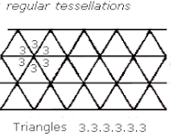
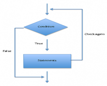
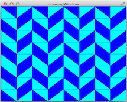
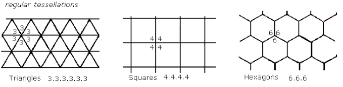
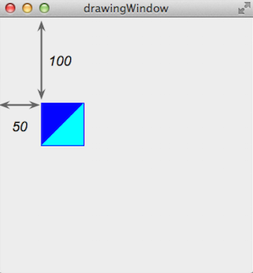
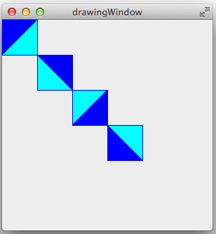
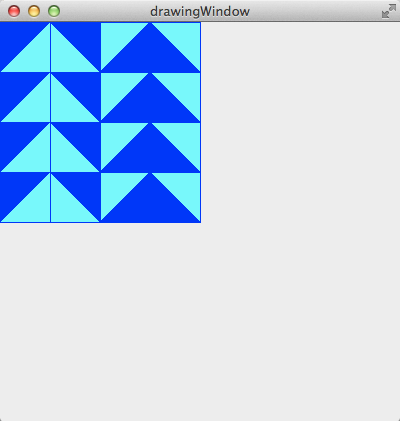
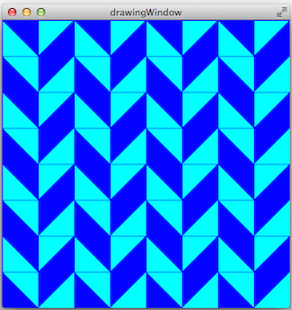
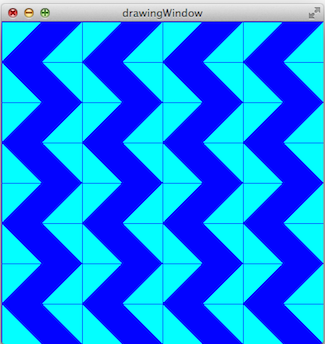
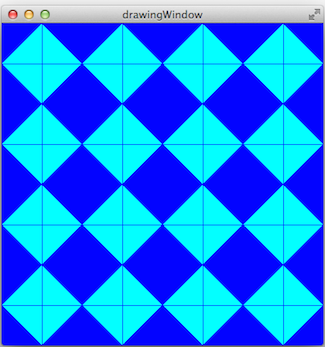

# Estructuras de repetición - Mosaicos






Una de las ventajas de utilizar programas de computadoras es que podemos realizar tareas repetitivas fácilmente. Los ciclos como `for`, `while`, y `do-while` son estructuras de control que nos permiten repetir un conjunto de instrucciones. A estas estructuras también se les llama *estructuras de repetición*. En la experiencia de laboratorio de hoy, practicarás el uso de ciclos anidados para producir patrones y mosaicos. Esta experiencia de laboratorio es una adaptación de https://sites.google.com/a/wellesley.edu/wellesley-cs118-spring13/lectures-labs/lab-2.


## Objetivos:

1. Practicar el uso de estructuras de repetición al construir patrones y mosaicos.

2. Reforzar las destrezas de uso de funciones y objetos.


## Pre-Lab:

Antes de llegar al laboratorio debes haber:

1. Repasado los conceptos básicos relacionados a estructuras de repetición.

2. Estudiado los conceptos e instrucciones para la sesión de laboratorio, especialmente el uso de los métodos para:

    a. ajustar el tamaño de las ventanas,

    b. colocar las teselaciones en posiciones específicas,

    c. rotar teselaciones.

3. Tomado el quiz Pre-Lab, disponible en Moodle.

---

---


## Teselaciones

Una *teselación* ("tessellation" o "tilling") es un mosaico que se crea repitiendo una figura para cubrir una superficie sin dejar huecos y sin solapamientos. Una *teselación regular* es una figura que se forma repitiendo un mismo *polígono regular*, como triángulos, cuadrados o hexágonos. (Un polígono regular es un polígono cuyos lados son congruentes y en el que los ángulos que forman los lados son congruentes.)  

---



**Figura 1.** Las únicas teselaciones regulares posibles obtenidas usando triángulos, cuadrados o hexágonos.

---


## Biblioteca

El proyecto `Tessellations.pro` disponible en `http://bitbucket.org/eip-uprrp/repetitions1-tessellations` contiene la clase `Tessellation`, que es una abstracción de una teselación con cuadrados, y la clase `DrawingWindow`. El código de muestra en la Figura 2 crea un `DrawingWindow` llamado `w`, un `Tessellation` llamado `t` y coloca la teselación en la posición (50,100). Nota que el método `addTessellation` de la clase `DrawingWindow` debe ser invocado para que la teselación se dibuje.

---

```cpp
int main(int argc, char *argv[]) {
    QApplication a(argc, argv);

    DrawingWindow w;        // crea el objeto w de la clase DrawingWindow 
    w.resize(300, 300);
    w.show();

    Tessellation t;          // crea el objeto t de la clase Tessellation 
    t.move(50,100);         // dice la posición de la teselacion

    w.addTessellation(t);    // añade la teselacion a la ventana

    return a.exec();
}
```

**Figura 2.** Código en función `main` para crear ventana y teselación.

---

La ventana que se obtiene con el código de la Figura 2 es similar a la ventana en la Figura 3. Las flechas y los números 50 y 100 ilustran los espacios entre la esquina superior izquierda de la teselación y los bordes de la ventana. La esquina superior izquierda de la teselación está en la posición (50,100).

---



**Figura 3.** Ventana con teselación en la posición (50,100).

---

**Ejemplo 1.** El código de la Figura 4 contiene una función `foo` para dibujar cuatro teselaciones en las posiciones (0,0), (50,50), (100,100), y (150,150), con rotaciones de la figura original de $$0^\circ, 90^\circ, 180^\circ y 270^\circ$$ (a favor de las manecillas del reloj). 

---

```cpp
int foo(DrawingWindow &w) {
    int rot = 0;
    for (int i = 0; i < 4; i++) {
        Tessellation t;
        t.setRotation(rot);
        t.move(i * 50, i * 50);
        w.addTessellation(t);
        rot += 90;
    }
}

int main(int argc, char *argv[]) {
    QApplication a(argc, argv);

    DrawingWindow w;
    w.resize(300, 300);
    w.show();

    foo(w);
    return a.exec();
}
```

**Figura 4.** Código de la función `foo` que dibuja cuatro teselaciones.

---

Observa cómo la función `foo` necesita recibir una referencia al objeto `w` de la clase `DrawingWindow` ya que está invocando el método `addTessellation`  de esta clase en cada iteración del ciclo. La figura que se obtiene es similar a la de la Figura 5.

---



**Figura 5.** Teselaciones dibujadas por la función `foo` en el código de la Figura 4.

---

**Ejemplo 2.** El código de la Figura 6 nos muestra un ejemplo del uso de ciclos anidados para crear teselaciones.

---

```cpp
int fah(DrawingWindow &w) {
    int rot = 0;
    for (int i = 0; i < 4; i++) {
      for (int j = 0; j < 4; j++) {
        Tessellation t;
        t.move(i * 50, j * 50);
        t.setRotation(rot);
        w.addTessellation(t);
      }
      rot += 90;
    }
}
```

**Figura 6.** Código de la función `fah` que utiliza ciclos anidados para dibujar cuatro teselaciones.

La figura que se obtiene es similar a la de la Figura 7.

---



**Figura 7.** Teselaciones dibujadas por la función `fah` en el código de la Figura 6.


---

---

!INCLUDE "../../eip-diagnostic/tesselations/es/diag-tesselations-01.html"
<br>

!INCLUDE "../../eip-diagnostic/tesselations/es/diag-tesselations-02.html"
<br>

---

---


## Sesión de laboratorio:

En la experiencia de laboratorio de hoy practicarás el uso de ciclos anidados para crear distintas teselaciones.

### Ejercicio 1 - Estudiar el ciclo que produce teselaciones

#### Instrucciones:

1. Carga a `QtCreator` el proyecto `Tessellations`. Hay dos maneras de hacer esto:

     * Utilizando la máquina virtual: Haz doble “click” en el archivo `Tessellations.pro` que se encuentra  en el directorio `/home/eip/labs/repetitions-tessellations` de la máquina virtual.
     * Descargando la carpeta del proyecto de `Bitbucket`: Utiliza un terminal y escribe el comando `git clone http:/bitbucket.org/eip-uprrp/repetitions-tessellations` para descargar la carpeta `repetitions-tessellations` de `Bitbucket`. En esa carpeta, haz doble “click” en el archivo `Tessellations.pro`.

2.  El proyecto `Tessellations.pro` contiene las clases `Tessellation` y `DrawingWindow` y la función `foo`. Configura el proyecto y ejecuta el programa marcando la flecha verde en el menú de la izquierda de la ventana de Qt Creator. Debes observar una pantalla parecida a la Figura 5. 

    Esta figura se crea con la función `foo` mostrada en la Figura 4 y explicada en el Ejemplo 1. La función `foo` es invocada desde `main()`. En esta experiencia de laboratorio solo estarás haciendo cambios a la función `main()`.

    Estudia nuevamente la función `foo` y nota la creación de los objetos de la clase `Tessellations`, el uso del método `setRotation` y el método `move` para colocar la teselación en la posición deseada. Nota cómo las instrucciones en el ciclo `for` de la función utilizan el contador del ciclo para determinar la posición del cuadrado y cómo se incrementa el valor de la rotación. También nota que necesitas utilizar el método `addTessellation` para que la teselación se añada en la ventana `w`.


### Ejercicio 2 - Crear función y teselación `herringbone`

#### Instrucciones

1. Crea una función `herringbone` que produzca la teselación de la Figura 8. El tamaño de la ventana es 400x400. El tamaño de cada cuadrado de la teselación es su tamaño predeterminado: 50x50.

    ---

    

    **Figura 8.** Teselación que debe dibujar la función `herringbone`.

    ---

2. Comenta la invocación de la función `foo`.

3. Invoca la función `herringbone` desde `main()` y corre tu programa para que veas la teselación que creaste.

### Ejercicio 3 - Crear función y teselación `zigzag`

#### Instrucciones

1. Crea una función  `zigzag` que produzca la teselación de la Figura 9. 
   
    ---

    

    **Figura 9.** Teselación que debe dibujar la función `zigzag`.

    ---

2. Comenta la invocación de la función `herringbone`.

3. Invoca la función `zigzag` desde `main()` y corre tu programa para que veas la teselación que creaste.


### Ejercicio 4 - Crear función y teselación `diamond`

#### Instrucciones

1. Crea una función `diamond` que produzca la teselación de la Figura 10. 

    ---

    

    **Figura 10.** Teselación que debe dibujar la función `diamond`.

    ---

2. Comenta la invocación de la función `zigzag`.

3. Invoca la función `diamond` desde `main()` y corre tu programa para que veas la teselación que creaste.


---

---

## Entregas

Utiliza "Entrega" en Moodle para entregar el archivo `main.cpp` que contiene las funciones `herringbone`, `zigzag` y `diamond` que creaste en los Ejercicios 2, 3 y 4 y sus invocaciones. Recuerda utilizar buenas prácticas de programación, incluye el nombre de los programadores y documenta tu programa.

---

---

##Referencias

[1] https://sites.google.com/a/wellesley.edu/wellesley-cs118-spring13/lectures-labs/lab-2.

